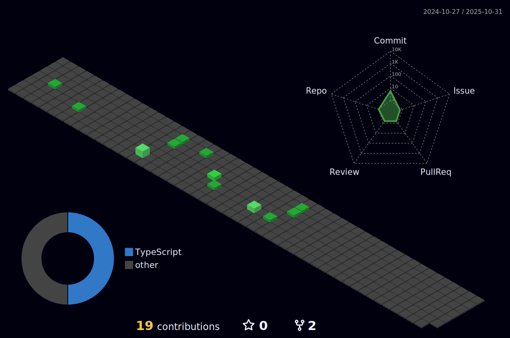

# Hi, I'm Diogo Rocha! 👋

  

  <a href="#about">About</a> •
  <a href="#github-stats">GitHub</a> •
  <a href="#tech-stack">Tech Stack</a> •
  <a href="#featured-projects">Projects</a> •
  <a href="#contact">Contact</a>

---

## 🔭 About Me
I'm Diogo Rocha — a frontend enthusiast who loves building polished UI experiences with modern tooling. I enjoy experimenting with new frameworks, improving developer DX, and creating delightful interactions.

- 🔧 Building with **React**, **Next.js**, **TypeScript**, and **TailwindCSS**  
- 🚀 Learning **Astro**, **Remix**, **Prisma**, and testing with **Jest**  
- ☕ Located in Brazil — open to collaboration & interesting frontend/backend projects

---

## ⚙️ GitHub Analytics

  
  

  

---

## 🛠️ Tech Stack

  
  
  
  
  
  
  
  
  
  
  

---

## 🌟 Featured Projects

> Click the project name to open the repo.

- **[Project One](https://github.com/diogorochaa/project-one)** — A polished Next.js + Tailwind portfolio template with MDX blog and light/dark theme support.
- **[Project Two](https://github.com/diogorochaa/project-two)** — Realtime chat using WebSockets + Node.js with a nice UI and message reactions.
- **[Project Three](https://github.com/diogorochaa/project-three)** — Tiny playground showcasing CSS animations and micro-interactions.

Want me to highlight 3 specific repos? Tell me the repo names and I'll replace these placeholders.

---

## 🎨 Snake Animation

  

---

## 📬 Contact

  
  
  

---
